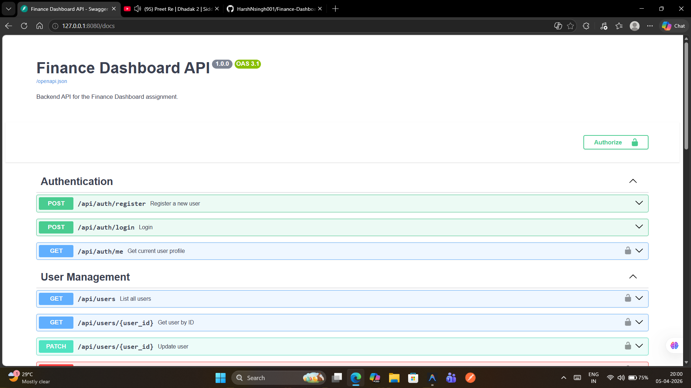
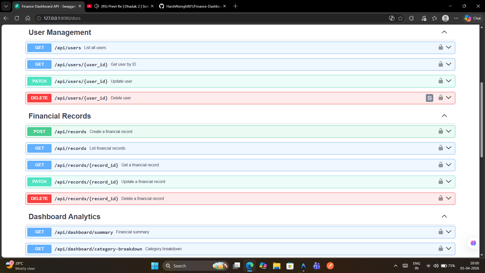
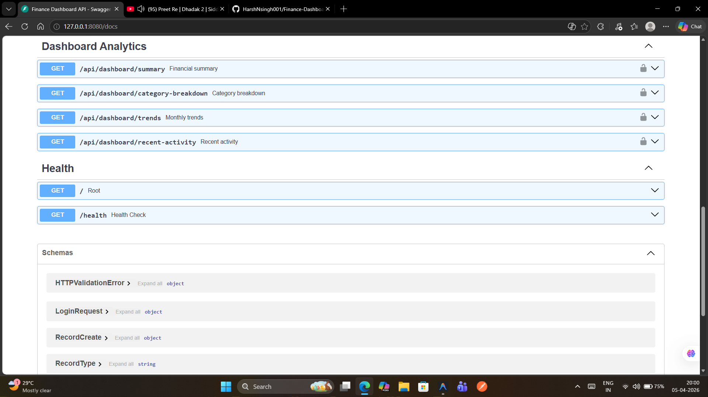
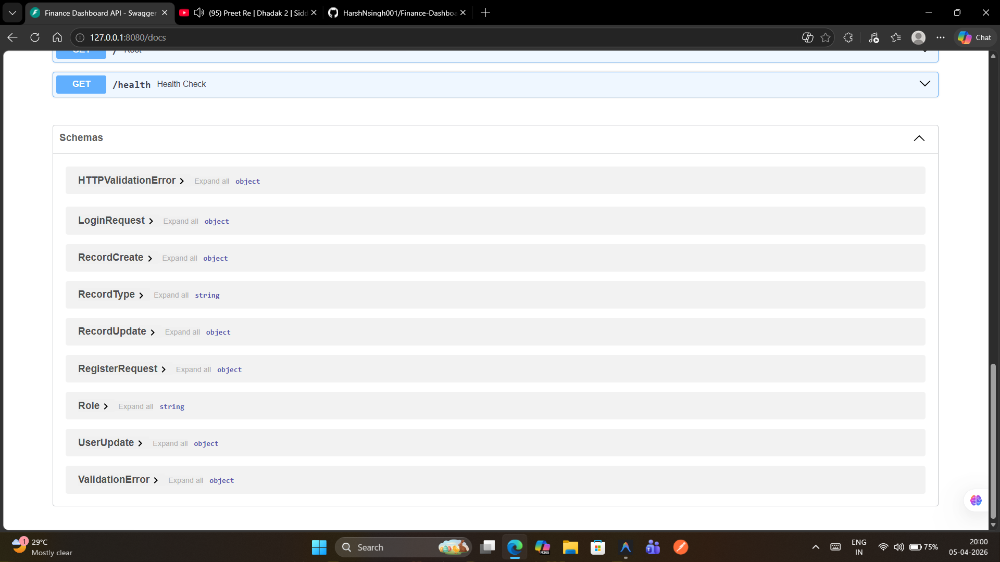

# Zoryab Finance Dashboard API

This is the backend for a finance dashboard system

The system manages financial records (income/expenses) and implements Role-Based Access Control (RBAC) with three distinct roles: Admin, Analyst, and Viewer.

## Tech Stack

- **Framework:** FastAPI
- **Database:** SQLite (SQLAlchemy ORM)
- **Authentication:** JWT (JSON Web Tokens)
- **Validation:** Pydantic v2
- **Persistence:** Alembic for migrations

## Features

- **User Management:** Registration, login, and profile management.
- **RBAC:**
  - `ADMIN`: Full access to users and records.
  - `ANALYST`: Can view records and advanced analytics/trends.
  - `VIEWER`: Read-only access to basic dashboard data.
- **Finance Logic:** CRUD for income and expenses with category filtering and date ranges.
- **Dashboard APIs:** Aggregated data for total income, expenses, net balance, and monthly trends.
- **Reliability:** Custom error handling, input validation, and rate limiting on auth endpoints.

## Getting Started

### 1. Setup Virtual Environment

```bash
# Create venv
python -m venv venv

# Activate venv
# Windows:
venv\Scripts\activate
# Linux/Mac:
source venv/bin/activate

# Install dependencies
pip install -r requirements.txt
```

### 2. Environment Configuration

Create a `.env` file in the root directory (you can use `.env.example` as a template).

```env
DATABASE_URL=sqlite:///./finance.db
SECRET_KEY=your_secret_key_here
ALGORITHM=HS256
ACCESS_TOKEN_EXPIRE_MINUTES=60
```

### 3. Run the Server

```bash
python -m uvicorn app.main:app --reload --port 8080
```

### 4. API Documentation

Once the server is running, visit:
[http://127.0.0.1:8080/docs](http://127.0.0.1:8080/docs)

## API Overview & Screenshots

Below are screenshots of the API documentation (Swagger UI) showcasing the different feature areas:

### 1. Authentication & User Management


### 2. Financial Records


### 3. Dashboard Analytics


### 4. API Schemas


## Running Tests

To run the included test suite:

```bash
pytest
```

## Decisions & Assumptions

- **Soft Deletes:** Records are not permanently deleted from the DB but marked as `deleted_at` to maintain history.
- **SQLite:** Used for simplicity and ease of evaluation without needing a complex DB setup.
- **Role Enforcement:** Handled via FastAPI dependencies for clean and reusable access control.
